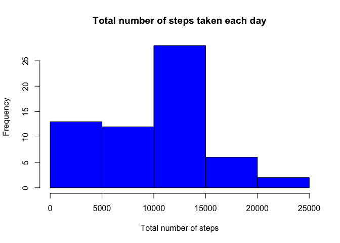
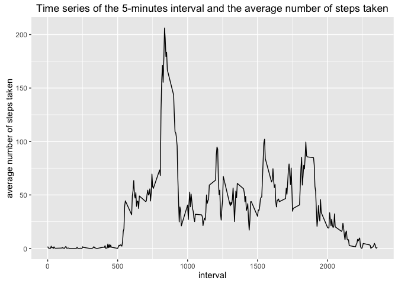
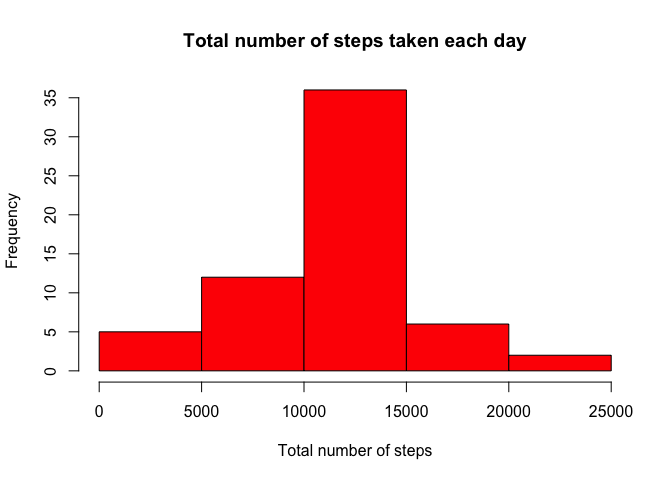
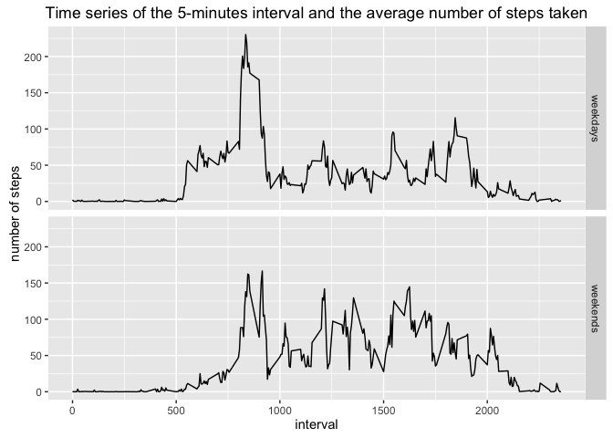

# Reproducible Research: Peer Assessment 1


```r
library(knitr)
opts_chunk$set(echo=TRUE,cache=TRUE)
options(scipen=1,digits=2)
```


## Loading and preprocessing the data


```r
fileURL<-"https://d396qusza40orc.cloudfront.net/repdata%2Fdata%2Factivity.zip"
dateDownloaded<-date()
dateDownloaded
```

```
## [1] "Tue Jan 19 17:03:15 2016"
```

```r
download.file(fileURL,destfile="./Activity.zip",method="curl")
UnzipActivity <- unzip("Activity.zip")
activity <- read.csv(UnzipActivity)
```

## What is mean total number of steps taken per day?


```r
#load the dplyr package
library(dplyr)
#Calculate the total number of steps taken per day
activity_tbl <-tbl_df(activity)
TotSteps <- activity_tbl %>%
  group_by(date) %>%
  summarize(totsteps=sum(steps,na.rm=TRUE))

# Make a histogram of the total number of steps taken each day
with(TotSteps,hist(totsteps,col="blue",main="Total number of steps taken each day" ,xlab ="Total number of steps"))
```

\

```r
#Calculate and report the mean and median of the total number of steps taken per day
meansteps <- mean(TotSteps$totsteps)
medsteps <- median(TotSteps$totsteps)
```

The mean of the total number of steps taken per day is 9354.23 and the median is 10395.

## What is the average daily activity pattern?


```r
# load ggplot2 package
library(ggplot2)

meansteps <- activity_tbl %>%
  group_by(interval) %>%
  summarize(msteps=mean(steps,na.rm=TRUE))

#Make a time series plot (i.e. type = "l") of the 5-minute interval (x-axis) and the average number of steps #taken, averaged across all days (y-axis)
graph <- ggplot(meansteps,aes(interval,msteps))+
  geom_line()+
  ggtitle("Time series of the 5-minutes interval and the average number of steps taken")+
  labs(x="interval",y="average number of steps taken")
print(graph)
```

\

```r
maxint <- meansteps$interval[which.max(meansteps$msteps)]
```
The 5-minute interval, on average across all the days in the dataset which contains the maximum number of steps is 835.


## Imputing missing values


```r
# Calculate and report the total number of missing values in the dataset
# (i.e. the total number of rows with NAs)
nbrNAperCol <- sapply(lapply(activity,is.na),sum)

nbrNA <- max(nbrNAperCol)
```

The total number of missing value is 2304.  

We fill in all of the missing values using the following strategy:

 - look up in the steps column row by row, 
 - if we find a missing value, identify the value of 5-minute interval associated,
 - calculate the mean of all the non missing steps values that is associated with that 5-minute interval,
 - impute the mean computed to the missing value found.

The code used to create a new dataset that is equal to the original dataset with the missing value filled in is: 


```r
# create a copy of the dataset 
nactivity <- activity

#impute missing value
for (i in seq_along(nactivity$steps)) {
  if (is.na(nactivity$steps[i])) {
    int <- nactivity$interval[i]
    impute <- mean(nactivity$steps[nactivity$interval==int],na.rm=TRUE)
    nactivity$steps[i] <- impute
  }
} 
```


```r
# Make a histogram of the total number of steps taken each day

nactivity_tbl <-tbl_df(nactivity)

NTotSteps <- nactivity_tbl %>%
  group_by(date) %>%
  summarize(totsteps=sum(steps))

with(NTotSteps,hist(totsteps,col="red", main="Total number of steps taken each day" ,xlab ="Total number of steps"))
```

\

```r
#Calculate and report the mean and median of the total number of steps taken per day
nmeansteps <- mean(NTotSteps$totsteps)
nmedsteps <- median(NTotSteps$totsteps)
```

The mean of the total number of steps taken per day is 10766.19 and the median is 10766.19. 

These values differ from the first estimates (with the original dataset) especially the mean. The impact of imputing missing data on the estimates of the total daily number of steps is that the mean and the median increase from their original values. 


## Are there differences in activity patterns between weekdays and weekends?


```r
#format de date 
nactivity$dateconv <- as.Date(as.character(nactivity$date),"%Y-%m-%d")
Sys.setlocale("LC_TIME", "en_US");
```

```
## [1] "en_US"
```

```r
#Create a new factor variable in the dataset with two levels – 
#“weekday” and “weekend” indicating whether a given date is a weekday or weekend day.

nactivity$day <- weekdays(nactivity$dateconv)
wday <- c("Monday","Tuesday","Wednesday","Thursday","Friday");
wend <- c("Saturday","Sunday")

for (i in seq_along(nactivity$day)) {
  if (nactivity$day[i] %in% wday) {
    nactivity$fday[i] <- 1
  } else if (nactivity$day[i] %in% wend) {
    nactivity$fday[i] <- 2  
  }
}

nactivity$fday <- factor(nactivity$fday,levels=c(1,2),labels=c("weekdays","weekends"))
```


```r
nactivity_tbl <-tbl_df(nactivity)

navesteps <- nactivity_tbl %>%
  group_by(fday,interval) %>%
  summarize(nmsteps=mean(steps))

graph2 <- ggplot(navesteps,aes(interval,nmsteps))+
  geom_line()+facet_grid(fday ~ .)+
  ggtitle("Time series of the 5-minutes interval and the average number of steps taken")+
  labs(x="interval",y="number of steps")
print(graph2)
```

\

